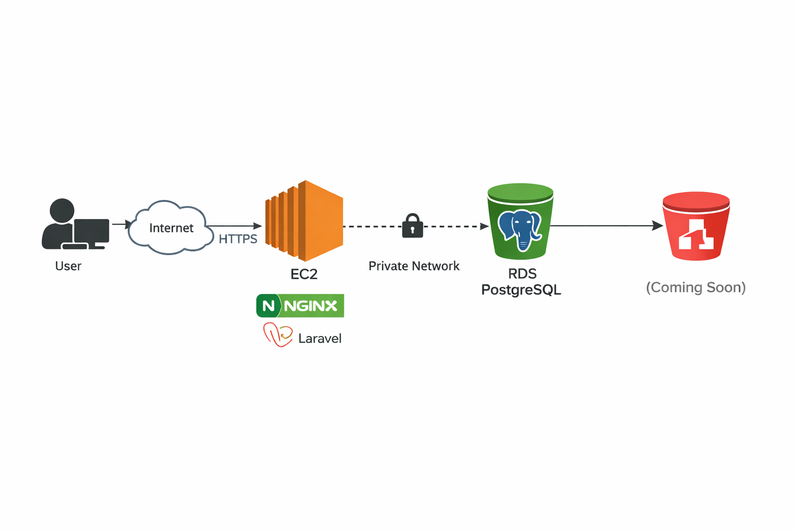

# CodeConnect

**Production Collaboration & Project Management Platform (AWS)**

  <strong>A modern, secure collaboration and project management platform deployed on AWS using a production-ready cloud architecture</strong>

---

## 🎯 About

CodeConnect is a comprehensive web-based platform designed to streamline team collaboration, project management, and communication. It enables teams and organizations to manage projects, collaborate in real time, and handle secure transactions using modern web and cloud technologies.

This project is deployed in a real production environment on AWS, demonstrating hands-on experience with cloud infrastructure, security, and deployment best practices.

## ✨ Key Features

- 🔐 **Secure Authentication** – Role-based access control (RBAC)
- 📋 **Project Management** – Create, track, and manage projects
- 👥 **Team Collaboration** – Assign tasks and monitor progress
- 💬 **Communication Hub** – Integrated notifications and messaging
- 📊 **Analytics Dashboard** – Insights into project and team performance
- 💳 **Payment Integration** – Stripe payment processing
- 📱 **Responsive Design** – Works across desktop and mobile devices
- 🎨 **Modern UI/UX** – Built with Tailwind CSS and Vue.js
## 🛠 Tech Stack

### Backend
| Component | Technology |
|-----------|------------|
| Framework | Laravel 12 |
| Language | PHP 8.3 |
| Database | PostgreSQL |
| ORM | Eloquent |
| Cache | Database cache |
| Sessions | Database-backed sessions |

### Frontend
| Component | Technology |
|-----------|------------|
| Framework | Vue.js 3 |
| Routing & Views | Inertia.js |
| Styling | Tailwind CSS |
| Build Tool | Vite |

### Services & Integrations
| Service | Provider |
|---------|----------|
| Payment Gateway | Stripe |
| Mail Driver | Log (configurable) |
| Storage | Local filesystem (S3 planned) |
## ☁️ Cloud Architecture & Deployment (AWS)

### Architecture Overview

CodeConnect is deployed on Amazon Web Services (AWS) using a production-style architecture focused on security, reliability, and scalability.

### AWS Services

#### Amazon EC2
- **OS**: Ubuntu Linux
- **Web Server**: Nginx (reverse proxy)
- **Application**: PHP-FPM running Laravel

#### Amazon RDS (PostgreSQL)
- **Database**: Managed relational database
- **Access**: Private (not publicly exposed)

#### Security Groups
- Database access restricted to EC2 only
- Port-based security rules

#### IAM
- Secure key-based access to EC2

### Architecture Highlights

1. **Public Access**: Users access the application via the internet
2. **Application Layer**: Application runs on an EC2 instance with Nginx and PHP-FPM
3. **Database Layer**: PostgreSQL database is hosted on Amazon RDS
4. **Security**: Database is not publicly accessible
5. **Connectivity**: EC2 communicates with RDS using Security Group-to-Security Group rules
6. **Configuration**: Environment variables managed securely using `.env`
### Deployment Process

1. **Infrastructure Setup**
   - Provisioned EC2 instance using Ubuntu AMI
   - Installed Nginx, PHP 8.3, Composer, Node.js, and required extensions

2. **Application Deployment**
   - Deployed Laravel application via Git
   - Executed Laravel migrations in production
   - Configured permissions for logs and cache directories

3. **Database Configuration**
   - Created PostgreSQL database on Amazon RDS
   - Configured Security Groups for private database access
   - Connected Laravel to RDS using environment variables

4. **Production Optimization**
   - Production configuration cached

## 🚀 Current Status

| Component | Status |
|-----------|--------|
| Application | ✅ Running in production |
| Database Connectivity | ✅ Secure EC2 ↔ RDS connection |
| Database Setup | ✅ Migrations completed |
| Configuration | ✅ Production config cached |

## 🎯 Planned Improvements

- [ ] **Security**: HTTPS with SSL (Certbot)
- [ ] **Storage**: Amazon S3 for file uploads
- [ ] **Networking**: Custom VPC with public and private subnets
- [ ] **Scalability**: Load balancer and auto scaling
- [ ] **Monitoring**: CloudWatch integration

## 📸 Screenshots

Screenshots are available in the `docs/screenshots/` directory:

- 🖥️ [EC2 instance running](docs/screenshots/ec2-running.png)
- 🗄️ [RDS database available](docs/screenshots/rds-available.png)
- 🔒 [RDS security group rules (SG-to-SG)](docs/screenshots/rds-security-group.png)
- 🌐 [Live application in browser](docs/screenshots/app-live.png)

## 🏗️ Project 2 – AWS VPC & Private RDS Architecture

This project demonstrates a production-style AWS networking setup.

### Architecture
- Custom VPC (non-default)
- Public subnet for application EC2
- Private subnets across two Availability Zones
- Internet Gateway and route tables
- Private PostgreSQL RDS (no public access)
- Security Group to Security Group access control

### Key Highlights
- RDS deployed in private subnets only
- Database access restricted to application security group
- Connectivity verified using SSL PostgreSQL client from EC2

📁 Screenshots and diagrams are available in:
`docs/project-2-networking/`

---

  <strong>Built with ❤️ using Laravel, Vue.js, and AWS</strong>

